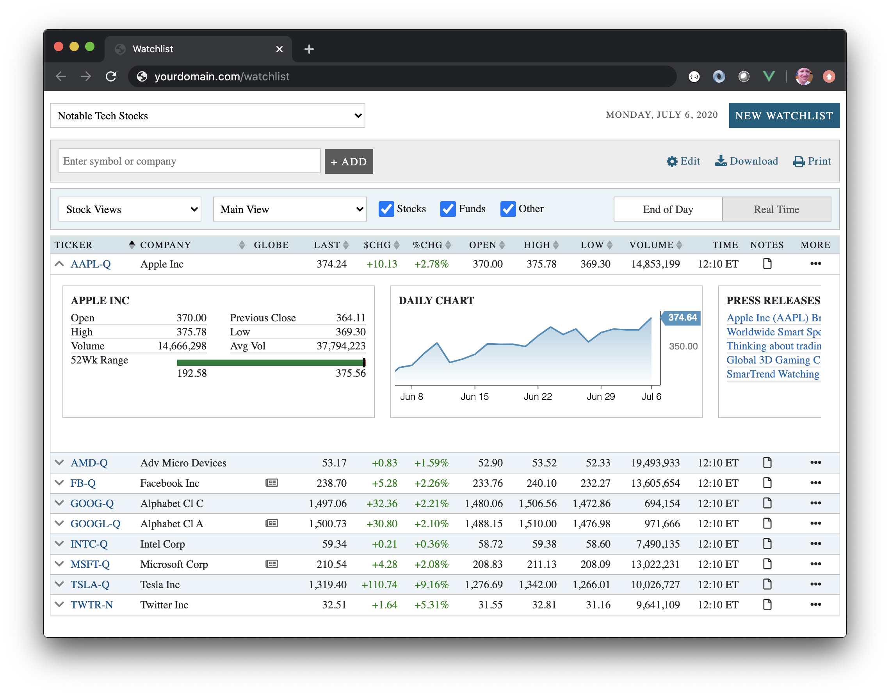

**This SDK connects your applications to the _Barchart Watchlist Service_ — a simple tool for building lists of investments.**

You can _quickly_ build an application that allows your users to:

* Create and name new _watchlists_
* Add investments to watchlists
* Remove investments from watchlists
* Delete watchlists

## Rich User Experiences

You can combine the Watchlist Service with additional [Barchart Solutions](https://www.barchart.com/solutions) to build powerful and engaging products:

* Add streaming market data quotes to watchlists.
* Add rich charting with live updates to watchlists.
* Add fundamental data to your watchlists.
* Add news articles from major news services to your watchlists.

Here is a simple single-page web application:

## Supported Environments

This SDK provides a convenient way to interact with the Barchart Watchlist Service. We recommend using it in JavaScript environments.

#### Web Browsers

This SDK can be distributed as part of your browser-based applications. The source code is written in [ES2018](https://en.wikipedia.org/wiki/ECMAScript#9th_Edition_%E2%80%93_ECMAScript_2018). Consequently, transpilation (or polyfill use) is recommended before distribution.

#### Node.js

This SDK is compatible with Node.js.

#### Direct Access

The Barchart Watchlist Service implements a REST interface via HTTP. You may choose to interact with the remote service directly, bypassing this SDK entirely. An [OpenAPI](https://www.openapis.org/) specification of the interface can be found in the [API Reference](/content/api_reference) section.

#### Other

If JavaScript isn't suitable for your environment, and you're not interested in direct access, please contact us at solutions@barchart.com or (866) 333-7587.

## User Privacy

Privacy is important to Barchart. We do not wish to transmit or collect personally identifiable information about your users. We encourage users of the Watchlist Service to avoid sharing identifying information.

Here's how:

* Each watchlist has an owner. Therefore, you **must** provide Barchart with unique user identifiers. However, these identifiers can be **meaningless** — other than to differentiate one user from another. [Universally Unique Identifiers](https://en.wikipedia.org/wiki/Universally_unique_identifier) are commonly used for this purpose.
* Each request to Barchart is authorized using JWT technology. You generate "tokens" and the Barchart verifies their authenticity. The tokens provide security; however they do not contain any sensitive information (e.g. passwords). You can read more about this in the [Key Concepts: Security](/content/concepts/security) section of the documentation.
